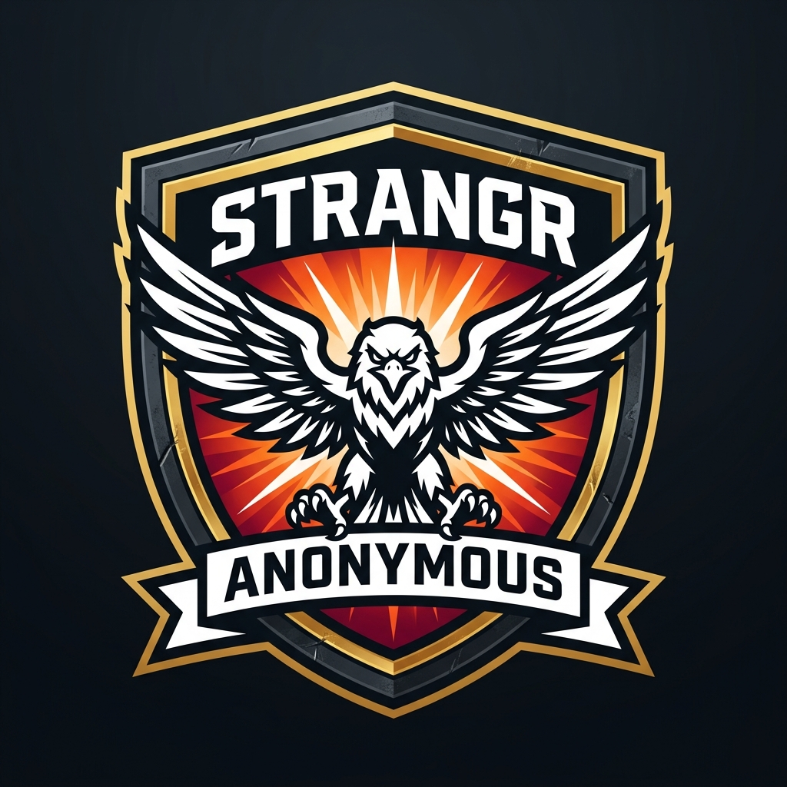

<div align="center">
  
  <h1>SafeHaven</h1>
  <p>A beautifully designed, anonymous community platform where you can share your problems and receive judgment-free advice.</p>

  <!-- Badges -->
  <p>
    
    
    
    
    
  </p>
</div>

---

## 🌟 Features

- **Anonymous Profiles:** Share your story without revealing your identity.
- **Google OAuth Integration:** Secure, one-tap login using Google Identity Services.
- **Immersive 3D Experience:** Interactive, fullscreen Spline 3D background with glassmorphism UI.
- **Engaging UI/UX:** Custom CSS micro-animations, animated cursors, and custom sound effects.
- **Responsive Design:** Flawless experience across desktop, tablet, and mobile.
- **Robust Error Handling:** Centralized API error management preventing crashes and leaking data.

## 🛠 Tech Stack

### Frontend
- **React.js** with **Vite** for blazing fast HMR.
- **React Router DOM** for client-side routing.
- **Axios** for API requests with interceptors.
- **Spline 3D** for interactive hero backgrounds.
- Pure Vanilla CSS for highly customized, performant styling.

### Backend
- **Node.js** & **Express.js** for the REST API.
- **MongoDB** & **Mongoose** for data storage and modeling.
- **JWT (JSON Web Tokens)** for secure, stateless authentication.
- **Bcrypt.js** for password hashing.
- Google OAuth API token verification.

---

## 🚀 Getting Started

Follow these steps to set up the project locally on your machine.

### Prerequisites
- [Node.js](https://nodejs.org/en/) (v16 or higher)
- [MongoDB](https://www.mongodb.com/try/download/community) (Local instance or MongoDB Atlas URI)

### 1. Clone the repository
```bash
git clone https://github.com/shivam-alpha911/safehaven.git
cd safehaven
```

### 2. Backend Setup
```bash
cd backend
npm install
```
Create a `.env` file in the `backend` directory:
```env
PORT=5000
MONGO_URI=mongodb://localhost:27017/safehaven
JWT_SECRET=your_super_secret_jwt_key
```
Start the backend server:
```bash
npm run dev
```

### 3. Frontend Setup
Open a new terminal window:
```bash
cd frontend
npm install
```
Create a `.env` file in the `frontend` directory:
```env
VITE_API_URL=http://localhost:5000/api
VITE_GOOGLE_CLIENT_ID=your_google_client_id.apps.googleusercontent.com
```
Start the frontend development server:
```bash
npm run dev
```
The app will be available at `http://localhost:5173`.

---

## 📂 Project Structure

```text
safehaven/
├── backend/                  # Node.js + Express Server
│   ├── middleware/           # Auth and Global Error Handlers
│   ├── models/               # Mongoose Schemas (User, Post)
│   ├── routes/               # API Endpoints
│   ├── utils/                # AppError and catchAsync Utilities
│   └── server.js             # Entry Point
│
└── frontend/                 # React + Vite Client
    ├── public/               # Static assets (MP3s, Images, 3D Canvas)
    ├── src/
    │   ├── api/              # Axios configurations
    │   ├── components/       # Reusable UI components
    │   ├── context/          # React Context (Auth)
    │   ├── pages/            # View components (Feed, Login, etc.)
    │   └── main.jsx          # React DOM render
    └── index.html            # Main HTML template
```

---

## ☁️ Deployment

- **Frontend:** Optimized for deployment on [Vercel](https://vercel.com). Make sure to set `Root Directory` to `frontend` and inject `VITE_GOOGLE_CLIENT_ID` and `VITE_API_URL` environment variables.
- **Backend:** Optimized for [Render](https://render.com) or Railway. Set `Root Directory` to `backend` and inject `MONGO_URI` and `JWT_SECRET`.
- **Database:** Hosted securely on [MongoDB Atlas](https://www.mongodb.com/cloud/atlas).

## 📄 License

This project is licensed under the MIT License - see the [LICENSE](LICENSE) file for details.
